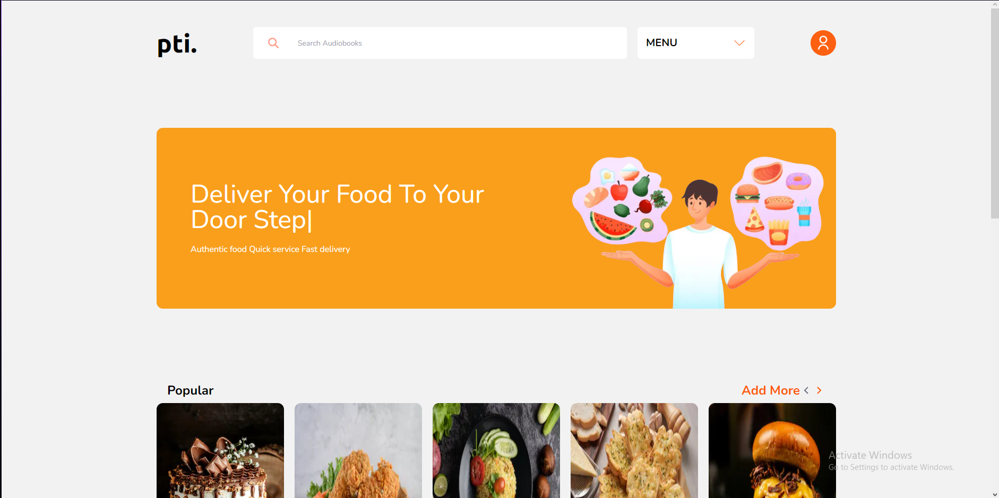
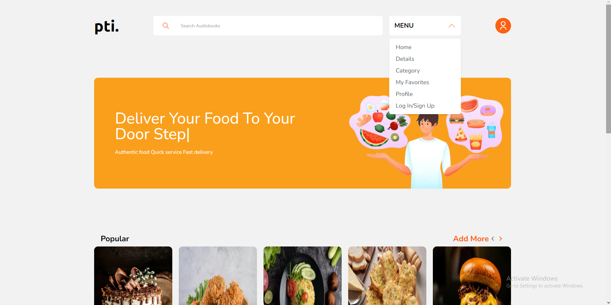
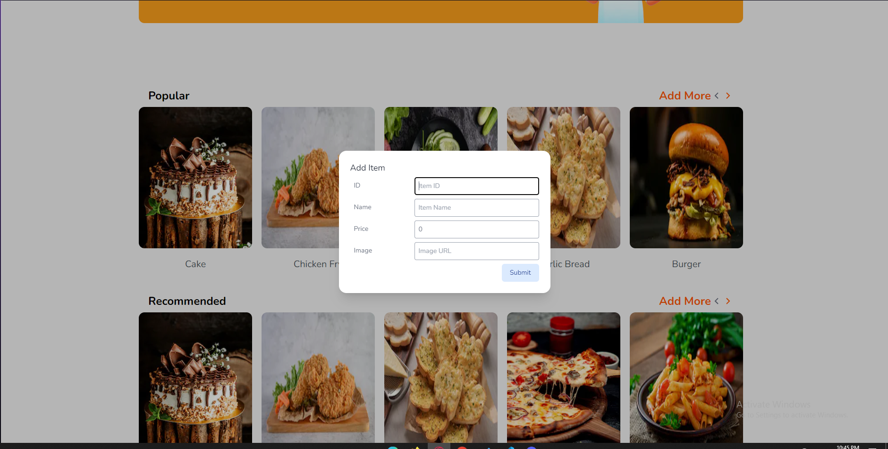

# Food-Menu

## Tech Used

- NetxJs
- Tailwind CSS
- Test API
- headless UI

## Visuals
- Initial Page after first load

- click on the Menu button to see the menu

- Click on Add More button to add more item to the menu
- fill up the form
- Here you have to add image url
- the must be on the public directory of the website
- to do that you have to clone the project first
- You can add an dummy image present in the public directory already
- here is the url: `/Image1.png`

